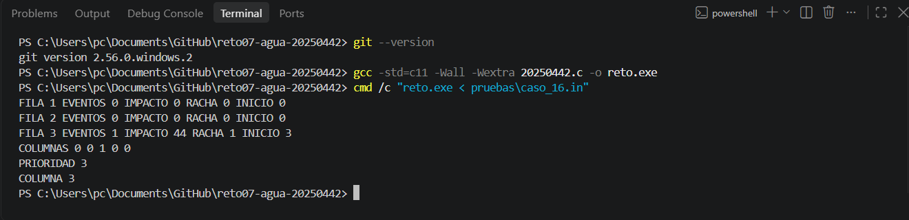

# Primera comprobación local en Windows — 06/10/2026

Estudiante: Eliezer Daniels Santana. Matrícula: 20250442.

## Entorno y evidencia

La prueba se realizó en la laptop del estudiante, desde la terminal PowerShell de Visual Studio Code y dentro de la carpeta del repositorio. La captura conserva los comandos y sus resultados.

- Git reconocido por la terminal: `git version 2.56.0.windows.2`.
- Compilador utilizado: GCC.
- Fuente utilizado: `20250442.c`.
- Versión de referencia del repositorio al realizar la prueba: `2066f89`.



## Compilación

Comando ejecutado:

```powershell
gcc -std=c11 -Wall -Wextra 20250442.c -o reto.exe
```

La terminal regresó al indicador de PowerShell sin mostrar errores ni advertencias. Se creó `reto.exe`, visible también en el explorador de Visual Studio Code de la captura anterior de compilación.

Las opciones `-Wall` y `-Wextra` activan advertencias del compilador. `-std=c11` selecciona el estándar C11 y `-o reto.exe` indica el nombre del ejecutable.

## Caso 16

Entrada utilizada: [caso_16.in](../../pruebas/caso_16.in).

```text
3 5 13 15
28 39 23 17 44
31 25 19 40 3
45 1 45 30 28
```

Comando ejecutado desde PowerShell:

```powershell
cmd /c "reto.exe < pruebas\caso_16.in"
```

Se utiliza `cmd /c` para ejecutar la redirección de entrada de este comando.

Transcripción de la salida visible en la captura:

```text
FILA 1 EVENTOS 0 IMPACTO 0 RACHA 0 INICIO 0
FILA 2 EVENTOS 0 IMPACTO 0 RACHA 0 INICIO 0
FILA 3 EVENTOS 1 IMPACTO 44 RACHA 1 INICIO 3
COLUMNAS 0 0 1 0 0
PRIORIDAD 3
COLUMNA 3
```

La salida visible coincide línea por línea con [caso_16.out](../../pruebas/caso_16.out): etiquetas, índices, valores y espacios. La captura permite revisar el texto mostrado; esta comprobación visual no constituye una comparación de los bytes del archivo de salida.

### Justificación del resultado

Los límites son L = 13 y U = 15. Las dos primeras filas no presentan un valor menor que 13 seguido inmediatamente por otro mayor o igual que 15.

En la fila 3, el salto de 1 a 45 cumple la condición. El evento pertenece a la columna 3, su impacto es 45 − 1 = 44, la racha tiene longitud 1 y empieza en esa columna. Por ello, la prioridad es la fila 3 y la columna destacada es la 3.

## Estado después de la prueba

- Git funciona en la terminal local.
- La compilación local terminó sin diagnósticos visibles.
- El caso 16 produjo la salida esperada en la revisión visual.
- Sigue pendiente ejecutar y comparar los 19 casos en Windows: 17 oficiales y dos propios.
- Sigue pendiente completar sección y enlace real de la actividad en el encabezado.

El ejecutable `reto.exe` está excluido del repositorio por `.gitignore`; se entregan el fuente y la evidencia.

## Comprobación preparada para los 19 casos

`verificar_pruebas_windows.ps1` compila el programa y ejecuta cada caso en un proceso distinto. Al ejecutarlo, creará una carpeta nueva dentro de `resultados/windows/` con versiones de herramientas, fecha local, identificación del fuente, registro de compilación, salidas obtenidas y resumen.

La comparación conserva mayúsculas, espacios, líneas y salto final; normaliza únicamente CRLF a LF para comparar los saltos de línea de Windows con los archivos del repositorio. Las salidas obtenidas se guardan sin modificar.

El script está preparado y revisado; su primera ejecución en Windows sigue pendiente. Su incorporación no significa que los 19 casos ya se hayan vuelto a ejecutar.

Comando para ejecutarlo desde la raíz del proyecto:

```powershell
powershell -NoProfile -ExecutionPolicy Bypass -File .\verificar_pruebas_windows.ps1
```

La opción `-ExecutionPolicy` se aplica al proceso que ejecuta esta comprobación. El resumen y las salidas deberán revisarse antes de registrar el resultado como completado.
