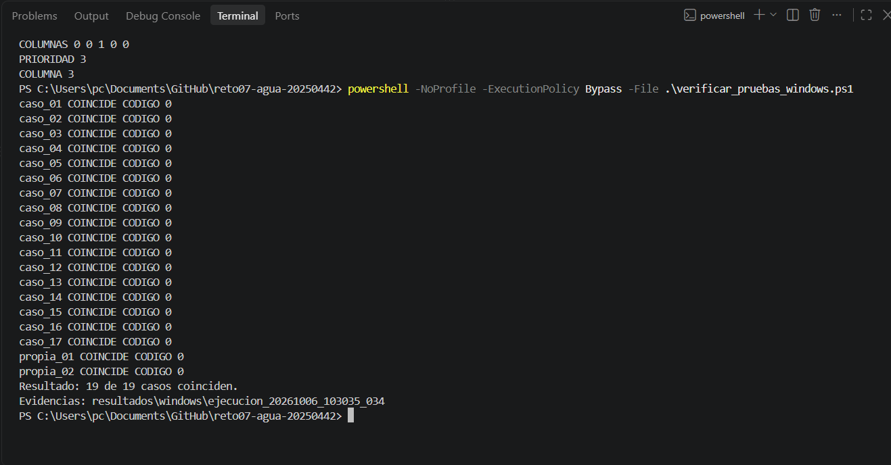

# Comprobación completa en Windows — 06/10/2026

Estudiante: Eliezer Daniels Santana. Matrícula: 20250442.

## Ejecución y evidencia

La comprobación se realizó en la laptop del estudiante desde la terminal PowerShell de Visual Studio Code, dentro de la carpeta del repositorio.

Comando visible en la captura:

```powershell
powershell -NoProfile -ExecutionPolicy Bypass -File .\verificar_pruebas_windows.ps1
```

El script se incorporó al repositorio en el commit `5d5f836`. Compila `20250442.c`, ejecuta cada caso en un proceso separado y compara su salida con el archivo esperado.



La imagen conserva la captura original, sin modificaciones.

## Resultado observado

Transcripción de las líneas del verificador visibles en la captura:

```text
caso_01 COINCIDE CODIGO 0
caso_02 COINCIDE CODIGO 0
caso_03 COINCIDE CODIGO 0
caso_04 COINCIDE CODIGO 0
caso_05 COINCIDE CODIGO 0
caso_06 COINCIDE CODIGO 0
caso_07 COINCIDE CODIGO 0
caso_08 COINCIDE CODIGO 0
caso_09 COINCIDE CODIGO 0
caso_10 COINCIDE CODIGO 0
caso_11 COINCIDE CODIGO 0
caso_12 COINCIDE CODIGO 0
caso_13 COINCIDE CODIGO 0
caso_14 COINCIDE CODIGO 0
caso_15 COINCIDE CODIGO 0
caso_16 COINCIDE CODIGO 0
caso_17 COINCIDE CODIGO 0
propia_01 COINCIDE CODIGO 0
propia_02 COINCIDE CODIGO 0
Resultado: 19 de 19 casos coinciden.
Evidencias: resultados\windows\ejecucion_20261006_103035_034
```

Las 17 pruebas oficiales y las dos propias coinciden con sus resultados esperados según el verificador. Todos los casos muestran código de salida 0.

## Método de comparación y justificación

El script exige tres condiciones para mostrar `COINCIDE`: código de salida 0, archivo de errores vacío y salida igual a la esperada. La igualdad distingue mayúsculas y conserva espacios, orden de líneas y salto final. Normaliza únicamente CRLF a LF para cotejar los saltos de línea de Windows con los archivos del repositorio. Las salidas obtenidas se guardan sin modificar.

Esta ejecución comprueba la instalación local y la respuesta del programa ante los 19 casos: entradas válidas e inválidas, dimensiones mínima y máxima, límites de la regla de evento, ausencia de eventos y desempates. El alcance de cada caso está explicado en [Resultados de las pruebas](../../RESULTADOS_PRUEBAS.md); las dos entradas propias y sus justificaciones están en [Pruebas propias](../../PRUEBAS_PROPIAS.md).

## Archivos generados y estado

La carpeta indicada por la terminal es `resultados/windows/ejecucion_20261006_103035_034`. El verificador guarda allí:

- `entorno.txt`: fecha local, versiones de herramientas, commit e identificación del fuente.
- `compilacion.txt`: diagnósticos de la compilación.
- Un archivo `.actual` y otro `.stderr.txt` por caso: salida obtenida y salida de errores.
- `resumen.txt`: comparaciones y resultado final.

Los archivos generados en la laptop están publicados en [la carpeta de esta ejecución](../../resultados/windows/ejecucion_20261006_103035_034), incorporados en el commit `00366ac`. Se conservan las salidas reales de la ejecución.

## Revisión de los archivos publicados

Se revisaron directamente las 19 salidas frente a sus archivos esperados. Todas coinciden al normalizar únicamente CRLF a LF; se conserva el resto del formato. Los 19 archivos de errores están vacíos.

El [registro de compilación](../../resultados/windows/ejecucion_20261006_103035_034/compilacion.txt) está vacío y el [resumen](../../resultados/windows/ejecucion_20261006_103035_034/resumen.txt) registra código 0 para la compilación y para cada uno de los 19 casos. La lista y el resultado final son coherentes con los archivos revisados.

El [registro de entorno](../../resultados/windows/ejecucion_20261006_103035_034/entorno.txt) indica:

| Dato | Valor registrado |
| --- | --- |
| Fecha de ejecución | 06/10/2026, 10:30:35, UTC−04:00 |
| Versión del repositorio probada | `5d5f836` |
| GCC | 16.1.0, MSYS2, Rev5 |
| Git | 2.56.0.windows.2 |
| PowerShell | 5.1.26100.9444 |
| Windows | Microsoft Windows NT 10.0.26200.0 |
| SHA256 del fuente local | `2d72e6b691d09807e50d278a3a8c435b87c389657f07dc45ed3dd20edb97c877` |

La huella del fuente corresponde a `20250442.c` de la versión `5d5f836`, representado con los saltos de línea CRLF de Windows. Después se actualizó únicamente el comentario del encabezado para incorporar el enlace de la actividad y el día de clase; las instrucciones del programa permanecen idénticas. Los registros conservan la huella de la versión ejecutada.

La regla `.gitattributes` añadida dentro de la carpeta de resultados conserva sus saltos de línea al incorporarlos a Git. Se verificó que las salidas publicadas mantienen CRLF.

La compilación, los 19 casos y la publicación de sus archivos están completados. El enlace de la actividad y el día de clase ya están incorporados al encabezado. Siguen pendientes el número oficial de sección, la preparación de la explicación del algoritmo y la confirmación del acceso del profesor y los requisitos de entrega.

No se modificaron el algoritmo, el script ni los datos de prueba para registrar este resultado. El ejecutable está excluido del repositorio; se conservan el fuente y las evidencias.
